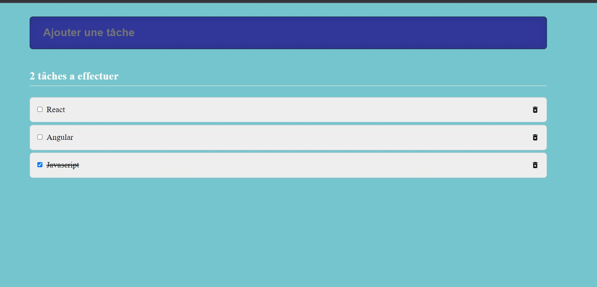

# TODOLIST
Créer une Todo-List en examiner les besoins 
:point_right: [ici](https://celine-nova.github.io/TodoList-react/) 

## Composants
### State component (App)
Composant avec un state pour gérer, modifier celui-ci et envoyer les données aux autres composants et faire un Re-rendu de tous les composants

### Control component (Form)
Contrôle du champ input par l'intermediaire des données du State. 

### Stateless component (Counter)
Composant sans State composant idiot ou composant de présentation. N'affiche que ce qu'on lui demande

## PropTypes
Validation de types des props d'un composant

### Librairie classNames
Lorsqu'il y a beaucoup de conditions sur un même element cela peut vite devenir désordonné. `classNames` facilite en rejoignant les conditionnelles ensemble

## Closure
Une fonction qui retourne une autre fonction avec code "dormant" et dont elle détient une information (une donnée)

### React Icons
*****************
